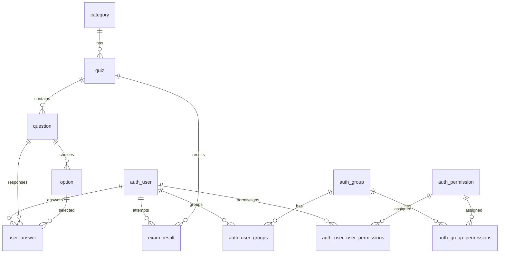

# Online Test Portal — Technical Documentation

**Version:** 1.0  
**Date:** 2025-09-03  
**Author:** Jay , Sarthak

---

## Table of Contents

1. [Executive Summary](#executive-summary)  
2. [Project Goals & Non‑Goals](#project-goals--non-goals)  
3. [System Overview](#system-overview)  
4. [Architecture](#architecture)  
   - [High-Level Diagram](#high-level-diagram)  
   - [Component Responsibilities](#component-responsibilities)  
5. [Client (React) Application](#client-react-application)  
   - [Folder Structure](#client-folder-structure)  
   - [Routing & Protected Routes](#routing--protected-routes)  
   - [Quiz UX & Functional Requirements](#quiz-ux--functional-requirements)  
   - [State Management & Hooks](#state-management--hooks)  
   - [Styling & Responsiveness](#styling--responsiveness)  
6. [Server (Django REST) Application](#server-django-rest-application)  
   - [Folder Structure](#server-folder-structure)  
   - [App Modules](#app-modules)  
   - [Request Lifecycle](#request-lifecycle)  
7. [Data Model & Database](#data-model--database)  
   - [Schema Overview](#schema-overview)  
   - [Entity-Relationship (ER) Notes](#entity-relationship-er-notes)  
   - [Migrations & Environments](#migrations--environments)  
8. [API Design](#api-design)  
   - [Auth Endpoints](#auth-endpoints)  
   - [Quiz Endpoints](#quiz-endpoints)  
   - [Analytics Endpoints](#analytics-endpoints)  
   - [Conventions](#conventions)  
9. [Authentication & Authorization](#authentication--authorization)  
10. [Key Application Flows](#key-application-flows)  
    - [Login Flow](#login-flow)  
    - [Quiz Attempt Flow](#quiz-attempt-flow)  
    - [Results & Analytics Flow](#results--analytics-flow)  
11. [Security Considerations](#security-considerations)  
12. [Performance, Caching & Scalability](#performance-caching--scalability)  
13. [Error Handling, Logging & Observability](#error-handling-logging--observability)  
14. [Testing Strategy](#testing-strategy)  
15. [Local Development & Setup](#local-development--setup)  
16. [Deployment Considerations](#deployment-considerations)  
17. [Accessibility & UX Guidelines](#accessibility--ux-guidelines)  
18. [Known Limitations](#known-limitations)  
19. [Roadmap & Future Enhancements](#roadmap--future-enhancements)  
20. [Appendix: Sample Configs](#appendix-sample-configs)

---

## Executive Summary

The **Online Test Portal** is a full‑stack web application that enables users to register, authenticate, take timed quizzes, and view their performance analytics. The frontend is a **React** application (bundled with Vite) and the backend is a **Django REST Framework (DRF)** service backed by **SQLite** (development) with a clean path to **PostgreSQL** in production. The system enforces JWT‑based authentication, supports category‑driven quizzes, provides rich in‑quiz navigation (including a compact question index sidebar), and exposes analytics endpoints to power dashboards (overall performance, category performance, attempts history).

The system is designed to be modular: separate Django apps (**quiz**, **analytics**, **usermanagement**) encapsulate domain concerns, while the React client organizes UI into **components** with dedicated **styles** and clear routing.

---

## Project Goals & Non‑Goals

### Goals
- Provide a **reliable quiz‑taking experience** with timer, navigation, and answer persistence.
- Offer **secure user authentication** using JWT.
- Store **results** and compute **scores** on the backend with auditable records.
- Provide **analytics** for users and administrators (category trends, overall scores, top users).
- Enable **responsive** and **accessible** UI that works across devices.
- Keep architecture **extensible** so new categories, question types, or analytics can be added.

### Non‑Goals (Current Release)
- In‑browser proctoring or cheating detection.
- Real‑time collaboration or live competitions.
- Advanced AI‑driven question generation (can be part of roadmap).

---

## System Overview

- **Client (React)** renders pages for registration/login, instructions, quiz attempt, results, and analytics dashboards. It handles the quiz timer, question navigation, and a responsive question index sidebar.
- **Server (Django REST)** exposes APIs to manage users, questions, options, results, and analytics ingestion/aggregation.
- **Database (SQLite)** stores normalized entities: users, categories, questions, options, and attempts/results.

Interaction is secured with **JWT** (Bearer token). Client stores token (in memory or secure storage) and attaches it to API requests.

---

## Architecture

### High-Level Diagram

```
+------------------+           HTTPS (JWT)           +-----------------------------+
|   React Client   |  <----------------------------> |  Django REST API (DRF)      |
|  (Vite, JSX/CSS) |                                  |  Apps: quiz, analytics,     |
|                  |                                  |        usermanagement       |
+---------+--------+                                  +--------------+--------------+
          |                                                           |
          |                                                           |
          |                                     ORM (Models)          |
          |                                                           v
          |                                               +-----------------------+
          +----------------------------------------------> |   SQLite   |
                                                          +-----------------------+
```

### Component Responsibilities

- **Client**
  - Routing & Protected routes
  - Rendering quiz, handling selections (with unselect toggle), managing timer
  - Displaying results and analytics
  - Showing question index sidebar with adaptive layout (rows/columns as needed)

- **Server**
  - JWT authentication
  - Fetching quiz data (categories, questions, options)
  - Validating submissions, computing scores, storing attempts
  - Aggregating analytics per user and per category

- **Database**
  - Durable persistence of users, content, and results
  - Indexing by foreign keys for efficient lookups

---

## Client (React) Application

### Client Folder Structure

```
client/
└─ src/
   ├─ assets/
   │  ├─ background_image.png
   │  ├─ books_image.png
   │  ├─ progress_tracking.png
   │  ├─ react.svg
   │  ├─ Real_time_results.png
   │  └─ user_friendly_feature_icon.png
   │
   ├─ components/
      ├─analytics/
        ├─ AnalyticsDashboard.jsx
        ├─ CategoryAttemptsTable.jsx
        ├─ CategoryPerformanceChart.jsx
        ├─ DailyTrendsCharts.jsx
        ├─ OverallStats.jsx
        ├─ ScoreDistributionChart.jsx
        └─ TopUsersTable.jsx
      ├─quizapp/
        ├─ BulkQuestionForm.jsx
        ├─ InstructorHome.jsx
        ├─ DisplayResult.jsx
        ├─ Instructions.jsx
        ├─ Quiz.jsx
      ├─usermgmt
        ├─ Home.jsx
        ├─ Login.jsx
        ├─ ProtectedRoute.jsx
        ├─ Register.jsx
   |
   |
   ├─ styles/
   │  ├─ displayResult.css
   │  ├─ home.css
   │  ├─ instructions.css
   │  ├─ login.css
   │  ├─ quiz.css
   │  └─ register_styles.css
   │
   ├─ App.jsx
   ├─ App.css
   ├─ index.css
   └─ main.jsx
```

> **Notes**
> - `Quiz.jsx` implements the quiz experience including timer, sidebar nav, selection/unselection, and conditional **Submit** at the last question.
> - `ProtectedRoute.jsx` guards routes for authenticated users (redirect to login otherwise).
> - `AnalyticsDashboard.jsx`, `OverallStats.jsx`, `CategoryPerformanceChart.jsx`, and `CategoryAttemptsTable.jsx` are consumers of analytics APIs.

### Routing & Protected Routes

- `App.jsx` sets up top‑level routes, e.g.:
  - `/` (Home / Landing)
  - `/login`, `/register`
  - `/instructions`
  - `/quiz/:category`
  - `/result`
  - `/analytics`
- `ProtectedRoute.jsx` verifies JWT presence/validity (e.g., via context or a stored token). Unauthorized access redirects to **Login**.

### Quiz UX & Functional Requirements

- **Question Index Sidebar**: shows numbered circles; answered items highlighted.
- **Horizontal expansion then wrap**: for large quizzes, the sidebar allows multiple rows (grid/flow layout) before vertical scrolling, and font/size subtly adjusts to fit.
- **Selection Toggle**: clicking the selected option again unselects it.
- **Timer**: top‑right, counts down; when zero → auto‑submit (optional).
- **Prev/Next Navigation**: keyboard accessible; **Submit** button appears **only on the final question**.
- **Persistence**: selections persist as users navigate between questions.
- **Accessibility**: focus outline, ARIA labels for buttons/inputs.

### State Management & Hooks

- `useState` for current index, answers map, timer state.
- `useEffect` for timer countdown (interval + cleanup).
- `useEffect` for tracking per‑question time spent.
- Optional: `useMemo`/`useCallback` to optimize renders for long quizzes.
- Optional: global auth state via `Context` or lightweight state library.

### Styling & Responsiveness

- **CSS Modules (plain CSS)** under `/styles`.  
- Sidebar styles use CSS Grid/Flexbox to enable:
  - Fixed min/max width; adaptive **grid-auto-flow: column wrap** (or flex‑wrap) to form multiple rows.
  - `@media` queries to scale button size and font for small screens.
- Quiz container uses a responsive **card** with max width, soft shadows, and fluid spacing.

---

## Server (Django REST) Application

### Server Folder Structure

```
server/
├─ analytics/
│  ├─ migrations/
│  ├─ serializers/
│  ├─ services/
│  ├─ urls/
│  └─ views/
│
├─ quiz/
│  ├─ migrations/
│  ├─ urls/
│  │  ├─ master_category_urls.py
│  │  ├─ option_urls.py
│  │  ├─ question_urls.py
│  │  └─ results_urls.py
│  ├─ views/
│  ├─ models.py
│  ├─ serializers.py
│  ├─ urls.py
│  └─ tests.py
│-server/
│  ├─ asgi.py
│  ├─ settings.py
│  ├─ urls.py
│  ├─ wsgi.py
│  
|
├─ usermanagement/
│  ├─ migrations/
│  ├─ models.py
│  ├─ serializers.py
│  ├─ urls.py
│  └─ views.py
│
├─ settings.py
├─ urls.py
├─ asgi.py
├─ wsgi.py
└─ db.sqlite3
```

### App Modules

- **quiz**
  - **models.py**: `MasterCategory`, `Question`, `Option`, `ExamResult/ExamJourney` (naming may vary).
  - **serializers.py**: JSON<->Model serializers for the above.
  - **views.py**: question retrieval, submission endpoint, scoring logic.
  - **urls/**: REST endpoints split by resource (category, question, option, results).

- **analytics**
  - **services/**: aggregation logic (per‑category averages, attempts count).
  - **views/**: read‑only endpoints that drive dashboards.
  - **serializers/**: projection schemas for charts/tables.

- **usermanagement**
  - **models.py**: custom `User` if needed or Django default.
  - **views.py**: registration, login, JWT integration.
  - **serializers.py**: user DTOs and auth serializers.

- **server**
 - **asgi.py** – ASGI configuration for async support.
 - **wsgi.py** – WSGI configuration for deployment.
 - **settings.py** – Django settings, installed apps, middleware, database config, JWT, etc.
 - **urls.py** – Main URL router that includes app URLs.

### Request Lifecycle

1. Client sends request with **Authorization: Bearer <JWT>** (if protected).
2. DRF authenticates JWT, maps to `request.user`.
3. Viewset/function‑based view handles logic; may call `services/`.
4. Serializer validates and transforms data.
5. ORM persists/fetches records; response serialized to JSON.

---

## Data Model & Database


### Schema Overview (Illustrative SQL)

```sql
---sample examples of tabler creation
-- Master category of quiz content 
CREATE TABLE master_category (
  id INTEGER PRIMARY KEY,
  title TEXT NOT NULL,
  description TEXT
);

-- Individual question
CREATE TABLE question (
  id INTEGER PRIMARY KEY,
  category_id INTEGER NOT NULL REFERENCES master_category(id),
  text TEXT NOT NULL,
  difficulty TEXT, -- optional
  created_at DATETIME DEFAULT CURRENT_TIMESTAMP
);

-- Options for a question (one or more, with one correct in MCQ mode)
CREATE TABLE option (
  id INTEGER PRIMARY KEY,
  question_id INTEGER NOT NULL REFERENCES question(id),
  text TEXT NOT NULL,
  is_correct BOOLEAN NOT NULL DEFAULT 0
);

-- User table (simplified; often Django auth_user is used)
-- Using Django's built-in auth_user unless a custom user model is defined.

-- Result / Attempt record
CREATE TABLE exam_result (
  id INTEGER PRIMARY KEY,
  user_id INTEGER NOT NULL REFERENCES auth_user(id),
  category_id INTEGER NOT NULL REFERENCES master_category(id),
  score INTEGER NOT NULL,
  total INTEGER NOT NULL,
  started_at DATETIME,
  submitted_at DATETIME,
  time_spent_seconds INTEGER
);

-- Optional: pivot storing per-question selections
CREATE TABLE exam_answer (
  id INTEGER PRIMARY KEY,
  result_id INTEGER NOT NULL REFERENCES exam_result(id),
  question_id INTEGER NOT NULL REFERENCES question(id),
  selected_option_id INTEGER REFERENCES option(id),
  is_correct BOOLEAN
);

----- Detailed explanation of schema overview 
### 1. **auth_user**
- **Purpose**: Core user authentication and profile table managed by Django’s authentication system.
- **Key Attributes**:
  - `id` (Primary Key).
  - `username` – Unique login name.
  - `email` – User’s email.
  - `password` – Hashed password.
  - `first_name`, `last_name` – Optional personal details.
  - `is_superuser`, `is_staff`, `is_active` – Permission flags.
  - `last_login`, `date_joined` – Metadata for account activity.
- **Relationships**:
  - One-to-Many with **exam_result** (tracks attempts).
  - One-to-Many with **user_answer** (stores submitted answers).
  - Many-to-Many with **auth_group** and **auth_permission**.

---

### 2. **auth_group**
- **Purpose**: Groups of permissions for role-based access.
- **Key Attributes**:
  - `id` (Primary Key).
  - `name` – Group name.
- **Relationships**:
  - Many-to-Many with **auth_user** via `auth_user_groups`.
  - Many-to-Many with **auth_permission** via `auth_group_permissions`.

---

### 3. **auth_permission**
- **Purpose**: Stores all system-level permissions.
- **Key Attributes**:
  - `id` (Primary Key).
  - `name` – Permission name.
  - `content_type_id` – Links to `django_content_type`.
  - `codename` – Internal codename.
- **Relationships**:
  - Many-to-Many with **auth_group**.
  - Many-to-Many with **auth_user** (indirect via groups).

---

### 4. **auth_group_permissions**
- **Purpose**: Mapping table between groups and permissions.
- **Key Attributes**:
  - `id` (Primary Key).
  - `group_id` (FK → auth_group).
  - `permission_id` (FK → auth_permission).

---

### 5. **auth_user_groups**
- **Purpose**: Mapping table between users and groups.
- **Key Attributes**:
  - `id` (Primary Key).
  - `user_id` (FK → auth_user).
  - `group_id` (FK → auth_group).

---

### 6. **auth_user_user_permissions**
- **Purpose**: Mapping table between users and permissions (assigned individually).
- **Key Attributes**:
  - `id` (Primary Key).
  - `user_id` (FK → auth_user).
  - `permission_id` (FK → auth_permission).

---

### 7. **django_content_type**
- **Purpose**: Stores metadata about installed apps/models for Django’s permission system.
- **Key Attributes**:
  - `id` (Primary Key).
  - `app_label` – App name.
  - `model` – Model name.

---

### 8. **django_admin_log**
- **Purpose**: Records actions performed in the Django Admin interface.
- **Key Attributes**:
  - `id` (Primary Key).
  - `action_time`, `object_id`, `object_repr`.
  - `action_flag`, `change_message`.
  - `user_id` (FK → auth_user).
  - `content_type_id` (FK → django_content_type).

---

### 9. **django_migrations**
- **Purpose**: Tracks applied database migrations.
- **Key Attributes**:
  - `id` (Primary Key).
  - `app`, `name`, `applied` (timestamp).

---

### 10. **django_session**
- **Purpose**: Stores session data for logged-in users.
- **Key Attributes**:
  - `session_key` (Primary Key).
  - `session_data` – Encrypted session info.
  - `expire_date`.

---

### 11. **category**
- **Purpose**: Groups quizzes into subject domains.
- **Key Attributes**:
  - `id` (Primary Key).
  - `name` – Category name.
  - `description` – Optional description.
- **Relationships**:
  - One-to-Many with **quiz**.

---

### 12. **quiz**
- **Purpose**: Represents a specific exam/test.
- **Key Attributes**:
  - `id` (Primary Key).
  - `title` – Quiz title.
  - `category_id` (FK → category).
  - `total_questions`.
  - `time_limit`.
  - `created_at`.
- **Relationships**:
  - One-to-Many with **question**.
  - One-to-Many with **exam_result**.

---

### 13. **question**
- **Purpose**: Stores quiz questions.
- **Key Attributes**:
  - `id` (Primary Key).
  - `quiz_id` (FK → quiz).
  - `question_txt` – Question statement.
- **Relationships**:
  - One-to-Many with **option**.
  - One-to-Many with **user_answer**.

---

### 14. **option**
- **Purpose**: Stores possible answers for questions.
- **Key Attributes**:
  - `id` (Primary Key).
  - `question_id` (FK → question).
  - `option_text`.
  - `is_correct` – Boolean for correct answer.
- **Relationships**:
  - Many-to-One with **question**.
  - Cross-referenced in **user_answer**.

---

### 15. **user_answer**
- **Purpose**: Records answers given by users.
- **Key Attributes**:
  - `id` (Primary Key).
  - `user_id` (FK → auth_user).
  - `question_id` (FK → question).
  - `option_id` (FK → option).
  - `submitted_at`.
- **Relationships**:
  - Many-to-One with **auth_user**.
  - Many-to-One with **question**.
  - Many-to-One with **option**.

---

### 16. **exam_result**
- **Purpose**: Stores exam results for users.
- **Key Attributes**:
  - `id` (Primary Key).
  - `user_id` (FK → auth_user).
  - `quiz_id` (FK → quiz).
  - `score`.
  - `total_time`.
  - `attempted_on`.
- **Relationships**:
  - Many-to-One with **auth_user**.
  - Many-to-One with **quiz**.

---

### ERD (Entity Relationship Overview)



### Entity-Relationship (ER) Notes

- **Category 1—N Question**  
- **Question 1—N Option**  
- **User 1—N ExamResult**  
- **ExamResult 1—N ExamAnswer**

Indexes should exist on foreign keys (`category_id`, `question_id`, `user_id`) for performance.

### Migrations & Environments
- All schema changes tracked by Django migrations.
- Development uses **SQLite** (`db.sqlite3`). Production should use **PostgreSQL** for concurrency & indexing.
- Environment variables configure DB and JWT secrets.

---

## API Design

### Auth Endpoints
- `POST /api/user/register/` — Create user.
- `POST /api/user/login/` — Obtain JWT access/refresh tokens.
- `POST /api/user/logout/` — (If refresh token blacklisting is used).

### Quiz Endpoints
- `GET /api/quiz/categories/` — List categories.
- `GET /api/quiz/questions/?category={id}` — Fetch questions with options (no correct flags for security).
- `POST /api/quiz/submit/` — Submit answers:
  ```json
  {
    "category_id": 1,
    "answers": [
      { "question_id": 10, "selected_option_id": 77 },
      { "question_id": 11, "selected_option_id": 81 }
    ],
    "question_times": { "10": 14, "11": 22 }
  }
  ```
  **Response**: `{ "score": 18, "total": 30, "result_id": 123 }`

### Analytics Endpoints
- `GET /api/analytics/overall/` — Overall stats (avg score, total attempts).
- `GET /api/analytics/category/` — Performance by category for current user.
- `GET /api/analytics/top-users/` — Leaderboard (admin or public as per policy).
- `GET /api/analytics/attempts/` — Attempts history with timestamps.

> **Note:** Actual URL paths may differ based on `urls.py` grouping (`master_category_urls.py`, `question_urls.py`, `results_urls.py`). The above reflects the *intended* REST surface.

### Conventions
- JSON everywhere.
- JWT in `Authorization` header.
- Consistent snake_case keys in JSON (or camelCase if the client prefers; keep consistent).

---

## Authentication & Authorization

- **JWT (JSON Web Token)** approach:
  - On login, server issues **access** (short‑lived) and optionally **refresh** (longer‑lived) tokens.
  - Client stores tokens (prefer in memory; if persisted, use `httpOnly` cookies where possible).
  - Each protected API call includes `Authorization: Bearer <access_token>`.
  - Token rotation and blacklisting can be enabled for security.

- **Role-based access (optional)**:
  - `user` for quiz taking.
  - `admin` for content management and analytics across users.

---

## Key Application Flows

### Login Flow

```
[User] -> [React Login.jsx] -> POST /login -> [DRF Auth]
                                      |
                                  issue JWT
                                      v
                        store token, redirect to /instructions or /quiz/:category
```

### Quiz Attempt Flow

1. User opens `/quiz/:category` → client fetches questions & options.  
2. The **timer** starts; selections are stored in component state.  
3. Navigation via sidebar/prev/next keeps selection state intact.  
4. On last question, **Submit** button appears.  
5. Client posts submission payload to `/api/quiz/displayResult/`.  
6. Server validates, computes result, stores answers, and returns score.  
7. Client navigates to **DisplayResult** page with score & summary.

### Results & Analytics Flow

- After submission, **result_id** enables deep linking to results.
- Analytics pages query `/api/analytics/*` for historical and category‑wise performance.
- Charts/tables render trends and top performers.

---

## Security Considerations

- **Never send `isCorrect` flags** for options with question payloads to the client.
- Validate that submitted `question_id` and `selected_option_id` pairs match.
- Rate limit login endpoints; consider Captcha after repeated failures.
- Use HTTPS everywhere in production.
- Protect JWT secrets and DB credentials via environment variables.
- Sanitize all user input (serializers/validators already help).

---

## Performance, Caching & Scalability

- Paginate category/question lists for very large banks.
- Use `select_related`/`prefetch_related` in DRF to reduce N+1 queries.
- For analytics, pre‑aggregate summaries per user & category (materialized tables or cached values).
- Add Redis caching layer for hot endpoints in production.
- Static file serving via CDN (React build assets).

---

## Error Handling, Logging & Observability

- Consistent error response format:
  ```json
  { "error": { "code": "VALIDATION_ERROR", "message": "Bad payload", "details": {...} } }
  ```
- DRF exception handlers map to above format.
- Logging:
  - **App logs**: WARN/ERROR for exceptions, INFO for key events (login, submit).
  - **Access logs**: HTTP method, route, status, latency.
- Observability:
  - Add request ID correlation headers.
  - Integrate Sentry or similar for error tracking in prod.

---

## Testing Strategy

- **Backend**
  - Unit tests for serializers and services (quiz scoring, analytics aggregation).
  - API tests for quiz fetch/submit and auth.
- **Frontend**
  - Component tests for `Quiz.jsx` (timer, prev/next, submit visibility).
  - Integration tests for auth & protected routes.
- **E2E (optional)**
  - Cypress/Playwright scripted user flows.

---

## Local Development & Setup

### Prerequisites
- Node.js & npm (or pnpm)
- Python 3.11+ and pip
- (Optional) virtualenv

### Backend Setup
```bash
cd server
python -m venv .venv && source .venv/bin/activate  # Windows: .venv\Scripts\activate
pip install -r requirements.txt                     # ensure DRF and JWT libs in requirements
python manage.py migrate
python manage.py runserver
```

### Frontend Setup
```bash
cd client
npm install
npm run dev
```

### Environment Variables
Create `.env` files for both client & server. Examples in [Appendix](#appendix-sample-configs).
currently the functinality is added in settings.py file

---

## Deployment Considerations

- **Backend**
  - Use **Gunicorn + Nginx** (or ASGI with Uvicorn/Daphne for async needs).
  - Move from SQLite → **PostgreSQL**.
  - Configure environment variables (secrets/keys).
  - Run migrations on deployment.

- **Frontend**
  - `npm run build` and serve static files via Nginx or a CDN.
  - Configure API base URL in environment variables.

- **Security**
  - TLS termination at load balancer/CDN.
  - Add CORS policy on DRF (allowed origins).

---

## Accessibility & UX Guidelines

- Provide keyboard navigation for options and prev/next.
- Visible focus for buttons/links.
- Sufficient color contrast for timer, answered markers, and selected options.
- Announce timer updates politely (avoid screen‑reader spam).

---

## Known Limitations

- SQLite is not ideal for high concurrency; plan migration to PostgreSQL.
- Single‑choice MCQ only; multi‑select/subjective questions not implemented.
- No admin UI for authoring content (API‑only at present).

---

## Roadmap & Future Enhancements

- Admin panel for question/category authoring.
- Exam configurations (negative marking, shuffling, sectioning).
- Multi‑select, numeric, and coding question types.
- Proctoring and anti‑cheating (webcam/mic/behavioral signals).
- Email notifications and certificates.
- i18n/l10n for multi‑language support.
- Role‑based dashboards (student, educator, admin).

---

## Appendix: Sample Configs

### Example `client/.env`
```
VITE_API_BASE=https://api.example.com
VITE_ANALYTICS_ON=true
```

### Example `server/.env`
```
DJANGO_DEBUG=True
DB_ENGINE=django.db.backends.sqlite3
DB_NAME=db.sqlite3
JWT_SECRET=replace-me
JWT_ACCESS_TTL=900       # 15 minutes
JWT_REFRESH_TTL=2592000  # 30 days
CORS_ALLOWED_ORIGINS=http://localhost:5173
SECRET_KEY = currently hardcoded in settings.py
```

### Example DRF Settings Snippet
```python
REST_FRAMEWORK = {
  "DEFAULT_AUTHENTICATION_CLASSES": [
    "rest_framework_simplejwt.authentication.JWTAuthentication"
  ],
  "DEFAULT_PERMISSION_CLASSES": [
    "rest_framework.permissions.IsAuthenticated"
  ],
}
```

---

### Document History

- **v1.0** — Initial cut describing architecture, database, APIs, flows, and deployment.
